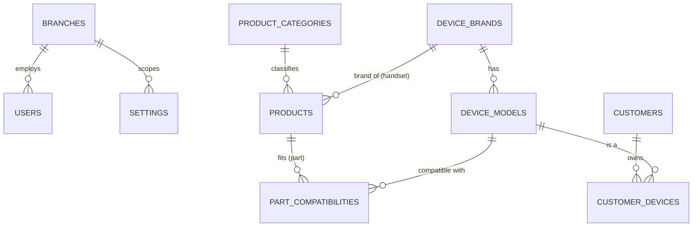
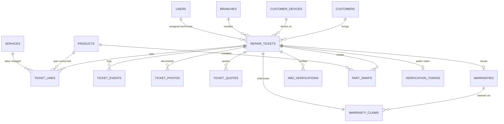
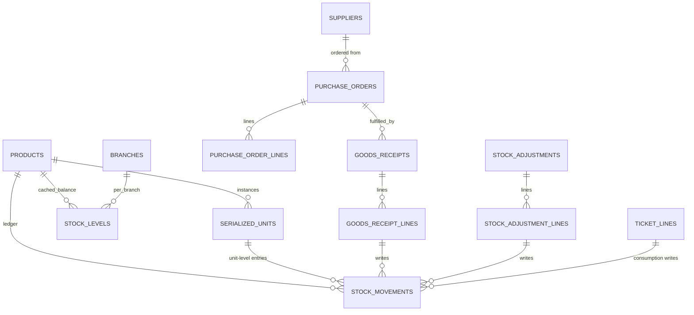
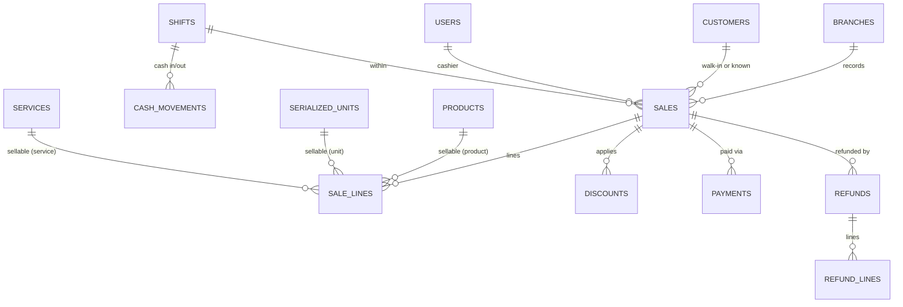
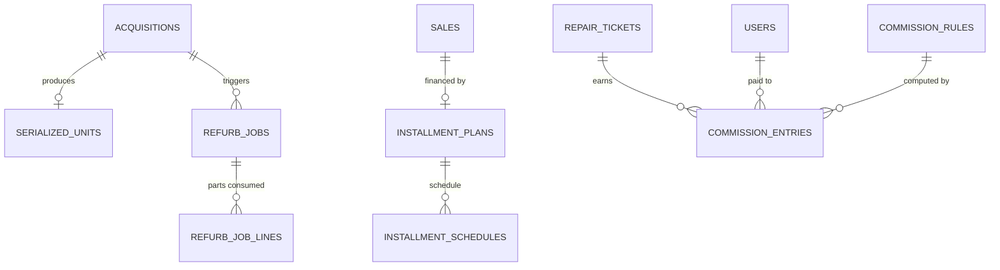
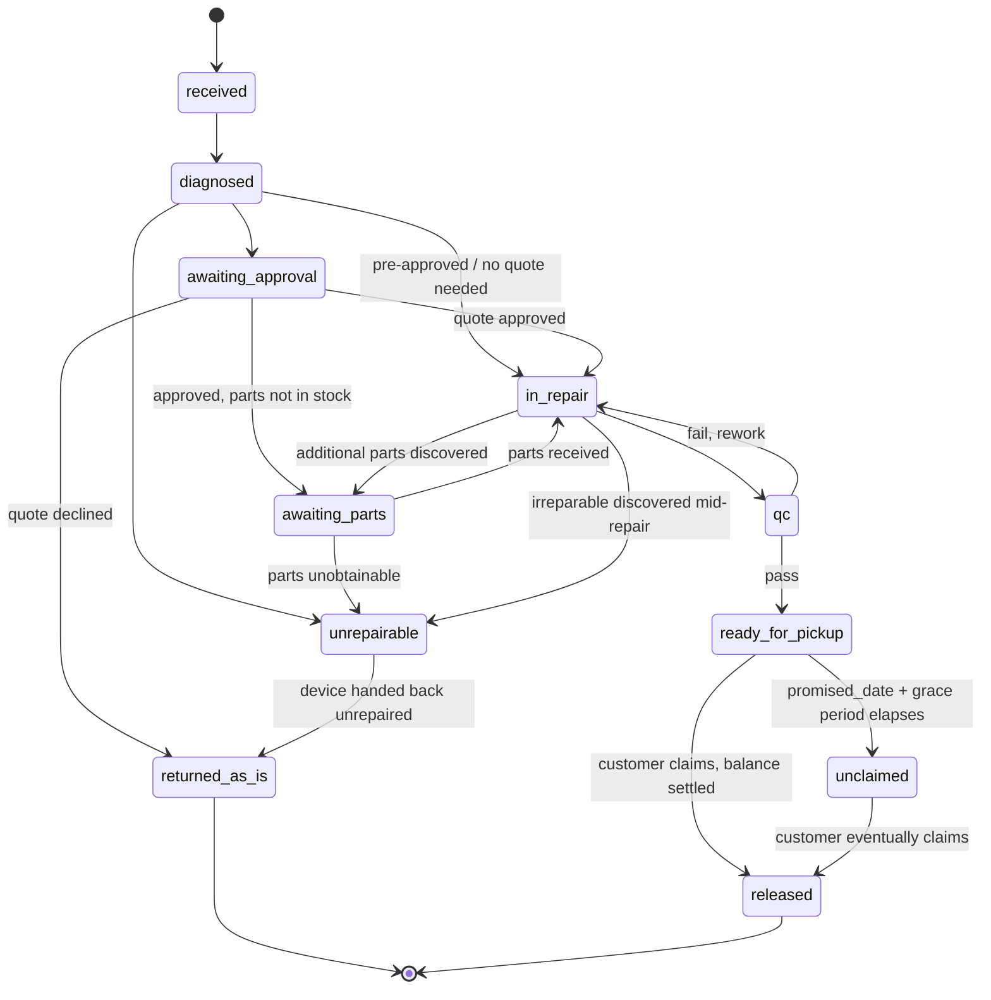

# Stage 1 — Domain Design (no code)

Status: **draft, pending review**. Nothing in Stage 2+ starts until this is signed off.

Conventions used throughout:
- `id` — `BIGINT UNSIGNED AUTO_INCREMENT PRIMARY KEY` on every table (internal, never exposed).
- `ulid` — `CHAR(26) UNIQUE NOT NULL` on every table that has its own route (`routes bind on the ULID`). Listed per table below. Chosen over `BINARY(16)` for readability in logs/receipts at the cost of 10 bytes/row and a slightly wider index — acceptable at this shop's volume.
- `created_at`, `updated_at` — `DATETIME(6)` UTC, on every table unless noted.
- `deleted_at` — only on the four tables Rule 8 names (`customers`, `products`, `suppliers`, `users`). See §7 Flag 1 — I recommend widening this.
- All money columns are `DECIMAL(14,2)`. All FKs are `ON DELETE RESTRICT` unless stated. All tables are `InnoDB` / `utf8mb4_unicode_ci` — see Flag 13 for why this diverges from the brief's `utf8mb4_0900_ai_ci`.
- Every table is implicitly `branch_id` scoped (via a global scope) except pure master/reference data that is shop-wide (`device_brands`, `device_models`, `services` catalog defaults, `settings` global rows).

---

## 1. Enum catalogue

| Enum | Values |
|---|---|
| `user.role` (spatie role name) | `owner`, `manager`, `cashier`, `technician` |
| `product.type` | `handset`, `accessory`, `part` |
| `serialized_unit.condition` | `brand_new`, `open_box`, `secondhand`, `refurbished` |
| `serialized_unit.grade` | `A`, `B`, `C` (nullable; only meaningful when condition = `secondhand`/`refurbished`) |
| `serialized_unit.status` | `in_stock`, `reserved`, `sold`, `for_repair`, `written_off` |
| `repair_ticket.status` | `received`, `diagnosed`, `awaiting_approval`, `awaiting_parts`, `in_repair`, `qc`, `ready_for_pickup`, `released`, `unrepairable`, `returned_as_is`, `unclaimed` |
| `ticket_photo.phase` | `intake`, `pre_repair`, `post_repair`, `release` *(brief said "intake and release"; widened to match `imei_verifications.phase` for consistency — Flag 2)* |
| `ticket_quote.channel` | `call`, `sms`, `viber`, `email`, `in_person`, `app` *(not enumerated in brief — proposed — Flag 3)* |
| `ticket_quote.decision` | `approved`, `declined`, `partial`, `no_response` |
| `imei_verification.phase` | `intake`, `pre_repair`, `post_repair`, `release` |
| `part_swap.disposition` | `returned_to_customer`, `retained_for_disposal`, `returned_to_supplier` |
| `warranty_claim.fault_attribution` | `part_defect`, `workmanship`, `customer_damage`, `not_covered` |
| `stock_movement.type` | `receipt`, `sale`, `return_in`, `return_out`, `ticket_consumption`, `adjustment`, `transfer_in`, `transfer_out`, `write_off` |
| `purchase_order.status` | `draft`, `submitted`, `partially_received`, `received`, `cancelled`, `closed` |
| `goods_receipt.status` | `draft`, `posted` |
| `stock_adjustment.reason_code` | config-driven allow-list: `count_variance`, `damage`, `theft_suspected`, `expiry`, `internal_use`, `sample`, `other` *(proposed — Flag 4)* |
| `sale.status` | `completed`, `voided`, `refunded`, `partially_refunded` |
| `sale.source` | `pos`, `online`, `offline_sync` |
| `sale_line.sellable_type` (polymorphic) | `product`, `serialized_unit`, `service`, `ticket_balance` |
| `discount.type` | `percent`, `amount`, `senior_citizen`, `pwd` |
| `payment.method` | `cash`, `gcash`, `maya`, `card`, `bank_transfer`, `store_credit`, `trade_in` |
| `refund_line.restock_behavior` | `restock`, `no_restock`, `write_off` *(proposed — Flag 5)* |
| `acquisition.imei_check_result` | `clear`, `flagged`, `not_checked` |
| `installment_schedule.status` | `pending`, `paid`, `overdue`, `waived` |
| `message_template.channel` | `viber`, `sms`, `email` |
| `notification_log.status` | `queued`, `sent`, `delivered`, `failed` |
| `unclaimed_notice.stage` | `30`, `60`, `90` (TINYINT, days) |
| `commission_rule.basis` | `flat`, `percent_of_labor`, `percent_of_margin` |
| `commission_entry.status` | `pending`, `payable`, `paid`, `reversed` |
| `document.type` (not a table, a route param) | `claim_stub`, `acknowledgment_receipt`, `warranty_slip`, `job_order`, `unclaimed_notice`, `shift_report` |
| `document_print.kind` | `original`, `reprint` |

---

## 2. Full table catalogue, by bounded context

### 2.1 Identity & shop

**branches** — ulid ✓
`name, legal_name, address_line1/2, city, province, postal_code, contact_phone, contact_email, tin (CHAR(15)), bir_permit_no, vat_registered BOOLEAN, receipt_header_text TEXT, receipt_footer_text TEXT, timezone VARCHAR(64) default 'Asia/Manila', is_active BOOLEAN, created_at, updated_at`

**users** — ulid ✓, soft-delete
`branch_id FK→branches, employee_code VARCHAR(20) UNIQUE, name, email UNIQUE, password_hash, is_active BOOLEAN, last_login_at, created_at, updated_at, deleted_at`
+ spatie `roles`, `permissions`, `model_has_roles`, `model_has_permissions`, `role_has_permissions` (package-managed)

**settings** — no ulid (keyed by name)
`branch_id FK→branches NULLABLE (null = global default), key VARCHAR(100), value JSON, type ENUM('string','int','decimal','bool','json'), UNIQUE(branch_id, key)`, cached in Redis on write.

**personal_access_tokens** (Sanctum, package table) — `name` used as device name, `abilities` JSON mirrors permissions.

---

### 2.2 Catalog

**device_brands** — ulid ✓, soft-delete *(Flag 1)*
`name UNIQUE, logo_ref, is_active, created_at, updated_at`

**device_models** — ulid ✓, soft-delete *(Flag 1)*
`device_brand_id FK, name, release_year SMALLINT, aliases JSON (array of strings), is_active, created_at, updated_at`
Index: `(device_brand_id, name)`, fulltext on `name` + generated column from `aliases` for search.

**services** — ulid ✓, soft-delete *(Flag 1)*
`name, category VARCHAR(60), default_price DECIMAL(14,2), default_duration_minutes INT, warranty_days SMALLINT, is_active, created_at, updated_at`

**product_categories** — ulid ✓, soft-delete *(Flag 1)*
`name, parent_id FK→product_categories NULLABLE, is_active, created_at, updated_at`

**products** — ulid ✓, soft-delete
`sku VARCHAR(40) UNIQUE, barcode VARCHAR(64) UNIQUE NULLABLE, name, product_category_id FK, device_brand_id FK NULLABLE, type ENUM(handset,accessory,part), cost DECIMAL(14,2), selling_price DECIMAL(14,2), is_serialized BOOLEAN, reorder_point INT UNSIGNED DEFAULT 0, track_inventory BOOLEAN DEFAULT TRUE, is_active, created_at, updated_at, deleted_at`
CHECK: `cost >= 0`, `selling_price >= 0`. Index `(type, is_active)`.

**part_compatibilities** — no ulid (pivot)
`product_id FK→products, device_model_id FK→device_models, UNIQUE(product_id, device_model_id)`

---

### 2.3 Customers & devices

**customers** — ulid ✓, soft-delete
`branch_id FK, name, mobile VARCHAR(13) (normalized +63…), email NULLABLE, address TEXT NULLABLE, notes TEXT, is_blacklisted BOOLEAN DEFAULT FALSE, blacklist_reason TEXT NULLABLE, created_at, updated_at, deleted_at`
UNIQUE `(branch_id, mobile)`. Fulltext/prefix index on `name`.

**customer_devices** — ulid ✓
`customer_id FK→customers RESTRICT, device_model_id FK NULLABLE, imei_normalized CHAR(15) NULLABLE, serial_number VARCHAR(40) NULLABLE, color VARCHAR(40), notes TEXT, created_at, updated_at`
Index `(imei_normalized)` **not unique** — same physical device can legitimately re-appear under a different customer record over its resale life; history is queried by IMEI across all rows, not constrained to one owner. See §7 Flag 6 for the query design.

---

### 2.4 Repairs

**repair_tickets** — ulid ✓ (this ulid *is* the QR/claim-code payload)
`ticket_number VARCHAR(20) UNIQUE (JO-YYYYMM-####), claim_code VARCHAR(10) UNIQUE, branch_id FK, customer_id FK RESTRICT, customer_device_id FK RESTRICT, device_brand_snapshot VARCHAR(80), device_model_snapshot VARCHAR(120), device_color_snapshot VARCHAR(40), reported_problem TEXT, problem_tags JSON, unlock_method VARCHAR(30) ENCRYPTED, unlock_value TEXT ENCRYPTED, accessories_turned_over JSON, intake_condition_checklist JSON, estimated_cost DECIMAL(14,2) NULLABLE, approved_amount DECIMAL(14,2) NULLABLE, downpayment DECIMAL(14,2) DEFAULT 0, balance DECIMAL(14,2) GENERATED (approved_amount - downpayment - other payments, maintained by service not as true generated column since it depends on payments table — see note), promised_date DATE, assigned_technician_id FK→users NULLABLE, status ENUM(...), warranty_days_offered SMALLINT DEFAULT 0, terms_accepted BOOLEAN DEFAULT FALSE, terms_accepted_at DATETIME NULLABLE, created_at, updated_at`
Index `(branch_id, status, promised_date)` per brief. Index `(customer_id)`, `(customer_device_id)`.
Note: `balance` is **not** a MySQL generated column (it depends on the `payments` ledger, a separate table) — it is a cached column recomputed by `TicketPaymentService` inside the same transaction as any payment/adjustment, same pattern as `stock_levels`.

**ticket_lines** — no ulid (nested under ticket)
`repair_ticket_id FK, line_type ENUM(part,labor), product_id FK NULLABLE, service_id FK NULLABLE, stock_movement_id FK NULLABLE, description VARCHAR(160), quantity DECIMAL(10,2), unit_cost DECIMAL(14,2) NULLABLE, unit_price DECIMAL(14,2), amount DECIMAL(14,2), created_at, updated_at`
CHECK: exactly one of `product_id`/`service_id` set depending on `line_type`.

**ticket_events** — append-only, no ulid, no updated_at
`repair_ticket_id FK, actor_id FK→users NULLABLE, event_type VARCHAR(40), from_status VARCHAR(20) NULLABLE, to_status VARCHAR(20) NULLABLE, note TEXT NULLABLE, metadata JSON, created_at`
Index `(repair_ticket_id, created_at)` — cursor pagination.

**ticket_photos** — ulid ✓ (used to build the signed URL)
`repair_ticket_id FK, phase ENUM(...), storage_disk VARCHAR(20), storage_path VARCHAR(255), sha256_hash CHAR(64), captured_at DATETIME, captured_by FK→users NULLABLE, created_at`

**ticket_quotes** — ulid ✓
`repair_ticket_id FK, quoted_amount DECIMAL(14,2), sent_at DATETIME, channel ENUM(...), responded_at DATETIME NULLABLE, decision ENUM(...) NULLABLE, responder_note TEXT NULLABLE, created_at, updated_at`

**warranties** — ulid ✓ (used for `warranty_slip` document)
`repair_ticket_id FK, scope TEXT, days SMALLINT, issued_at DATETIME, expiry_date DATE, exclusions TEXT, warranty_code VARCHAR(20) UNIQUE, created_at, updated_at`

**warranty_claims** — ulid ✓
`warranty_id FK→warranties RESTRICT, child_ticket_id FK→repair_tickets RESTRICT (the new no-charge ticket), fault_attribution ENUM(...), product_id FK→products NULLABLE (failed part), created_at, updated_at`

---

### 2.5 Chain of custody

**imei_verifications** — no ulid (nested under ticket)
`repair_ticket_id FK, phase ENUM(...), scanned_imei CHAR(15), matches_expected BOOLEAN, actor_id FK→users, override_reason TEXT NULLABLE, overridden_by FK→users NULLABLE, created_at`

**part_swaps** — no ulid (nested under ticket)
`repair_ticket_id FK, removed_description VARCHAR(160), removed_serial VARCHAR(60) NULLABLE, removed_photo_ref VARCHAR(255) NULLABLE, installed_product_id FK→products, installed_serial VARCHAR(60) NULLABLE, disposition ENUM(...), technician_id FK→users, created_at`

**verification_tokens** — token itself is the public id (no separate ulid column)
`repair_ticket_id FK UNIQUE, token CHAR(32) UNIQUE (random, unguessable, not sequential), created_at, revoked_at NULLABLE`

---

### 2.6 Inventory

**suppliers** — ulid ✓, soft-delete
`name, contact_name, contact_phone, contact_email, terms TEXT, notes TEXT, is_active, created_at, updated_at, deleted_at`

**serialized_units** — ulid ✓ (this ulid backs the unit's own QR/label)
`product_id FK, imei CHAR(15) UNIQUE NULLABLE, serial_number VARCHAR(60) UNIQUE NULLABLE, condition ENUM(...), grade CHAR(1) NULLABLE, acquisition_cost DECIMAL(14,2), acquisition_source VARCHAR(60), status ENUM(...), branch_id FK, warranty_terms TEXT NULLABLE, created_at, updated_at`
CHECK: `imei IS NOT NULL OR serial_number IS NOT NULL`.

**stock_levels** — no ulid (cache row, not routed directly)
`product_id FK, branch_id FK, on_hand_qty DECIMAL(14,2) DEFAULT 0, reserved_qty DECIMAL(14,2) DEFAULT 0, updated_at`
UNIQUE `(product_id, branch_id)`.

**stock_movements** — append-only ledger, ulid ✓ (cited from `ticket_lines`, receipts)
`product_id FK, branch_id FK, serialized_unit_id FK NULLABLE, quantity DECIMAL(14,2) (signed), unit_cost DECIMAL(14,2), movement_type ENUM(...), reference_type VARCHAR(60) NULLABLE (polymorphic), reference_id BIGINT UNSIGNED NULLABLE, reason_code VARCHAR(40) NULLABLE, actor_id FK→users, balance_after DECIMAL(14,2), occurred_at DATETIME(6), created_at`
Index `(product_id, branch_id, occurred_at)` per brief.

**purchase_orders** — ulid ✓
`branch_id FK, supplier_id FK RESTRICT, status ENUM(...), expected_date DATE NULLABLE, created_by FK→users, created_at, updated_at`

**purchase_order_lines** — no ulid
`purchase_order_id FK, product_id FK, ordered_qty DECIMAL(14,2), received_qty DECIMAL(14,2) DEFAULT 0, unit_cost DECIMAL(14,2)`

**goods_receipts** — ulid ✓
`branch_id FK, purchase_order_id FK NULLABLE, supplier_id FK, status ENUM(...), received_by FK→users, received_at DATETIME, created_at, updated_at`

**goods_receipt_lines** — no ulid
`goods_receipt_id FK, purchase_order_line_id FK NULLABLE, product_id FK, quantity DECIMAL(14,2), unit_cost DECIMAL(14,2), serialized_unit_id FK NULLABLE (set post-creation for handsets)`

**stock_adjustments** — ulid ✓
`branch_id FK, reason_code VARCHAR(40), note TEXT, created_by FK→users, created_at, updated_at`

**stock_adjustment_lines** — no ulid
`stock_adjustment_id FK, product_id FK, serialized_unit_id FK NULLABLE, quantity_delta DECIMAL(14,2) (signed), unit_cost DECIMAL(14,2)`

---

### 2.7 Sales / POS

**sales** — ulid ✓
`sale_number VARCHAR(20) UNIQUE, branch_id FK, customer_id FK NULLABLE, cashier_id FK→users, shift_id FK, subtotal DECIMAL(14,2), discount_total DECIMAL(14,2), vat_amount DECIMAL(14,2), vatable_sales DECIMAL(14,2), vat_exempt_sales DECIMAL(14,2), zero_rated_sales DECIMAL(14,2), total DECIMAL(14,2), status ENUM(...), void_reason TEXT NULLABLE, source ENUM(...), client_uuid CHAR(36) UNIQUE NULLABLE, created_at, updated_at`
Index `(branch_id, created_at)` per brief.

**sale_lines** — no ulid
`sale_id FK, sellable_type ENUM(...), sellable_id BIGINT UNSIGNED NULLABLE (polymorphic; null when sellable_type=ticket_balance), quantity DECIMAL(14,2), unit_price DECIMAL(14,2), unit_cost DECIMAL(14,2) (captured at sale time), line_discount DECIMAL(14,2) DEFAULT 0, amount DECIMAL(14,2)`

**discounts** — no ulid (child of sale/sale_line)
`sale_id FK, sale_line_id FK NULLABLE, type ENUM(...), value DECIMAL(14,2), scope ENUM(line,sale), id_type VARCHAR(30) NULLABLE, id_number VARCHAR(40) NULLABLE, cardholder_name VARCHAR(120) NULLABLE, signature_ref VARCHAR(255) NULLABLE, created_at`

**payments** — append-only, ulid ✓
`payable_type ENUM(sale,repair_ticket), payable_id BIGINT UNSIGNED, method ENUM(...), amount DECIMAL(14,2), reference_number VARCHAR(60) NULLABLE, tendered DECIMAL(14,2) NULLABLE, change_given DECIMAL(14,2) NULLABLE, shift_id FK NULLABLE, actor_id FK→users, created_at`

**refunds** — ulid ✓
`sale_id FK RESTRICT, reason_code VARCHAR(40), processed_by FK→users, created_at, updated_at`

**refund_lines** — no ulid
`refund_id FK, sale_line_id FK, quantity DECIMAL(14,2), amount DECIMAL(14,2), restock_behavior ENUM(...)`

**shifts** — ulid ✓
`branch_id FK, cashier_id FK→users, opened_at DATETIME, opening_float DECIMAL(14,2), closed_at DATETIME NULLABLE, counted_cash DECIMAL(14,2) NULLABLE, expected_cash DECIMAL(14,2) NULLABLE, variance DECIMAL(14,2) NULLABLE, notes TEXT, created_at, updated_at`

**cash_movements** — append-only, no ulid
`shift_id FK, direction ENUM(in,out), amount DECIMAL(14,2), reason VARCHAR(160), actor_id FK→users, created_at`

---

### 2.8 Buy-back & refurb

**acquisitions** — ulid ✓
`branch_id FK, seller_name VARCHAR(120), seller_id_type VARCHAR(30), seller_id_number VARCHAR(60), seller_id_photo_ref VARCHAR(255), declared_source TEXT, offered_price DECIMAL(14,2), imei CHAR(15), condition_assessment TEXT, purchase_date DATE, imei_check_result ENUM(...) DEFAULT 'not_checked', imei_checked_at DATETIME NULLABLE, resulting_serialized_unit_id FK→serialized_units NULLABLE, processed_by FK→users, created_at, updated_at`
CHECK enforced in service layer (not pure SQL): cannot transition to "completed" while `imei_check_result = 'flagged'`.

**refurb_jobs** — ulid ✓
`acquisition_id FK, serialized_unit_id FK, labor_cost DECIMAL(14,2) DEFAULT 0, parts_cost DECIMAL(14,2) DEFAULT 0, landed_cost DECIMAL(14,2) (parts+labor+acquisition_cost, cached), status ENUM(open,completed), completed_at DATETIME NULLABLE, created_at, updated_at`

**refurb_job_lines** — no ulid
`refurb_job_id FK, product_id FK, stock_movement_id FK, quantity DECIMAL(14,2), unit_cost DECIMAL(14,2)`

---

### 2.9 Installments

**installment_plans** — ulid ✓
`sale_id FK, principal DECIMAL(14,2), downpayment DECIMAL(14,2), term_months SMALLINT, schedule_rule VARCHAR(30) (e.g. monthly), status ENUM(active,completed,defaulted,cancelled), created_at, updated_at`

**installment_schedules** — no ulid
`installment_plan_id FK, due_date DATE, amount_due DECIMAL(14,2), amount_paid DECIMAL(14,2) DEFAULT 0, status ENUM(...), created_at, updated_at`
Index `(status, due_date)` for the overdue job.

---

### 2.10 Notifications & compliance

**message_templates** — ulid ✓, soft-delete? *(not master data per Rule 8 strictly, but behaves like it — Flag 1)*
`channel ENUM(...), event_key VARCHAR(60), body TEXT, is_active BOOLEAN, created_at, updated_at`

**notification_logs** — append-only, no ulid
`recipient VARCHAR(120), channel ENUM(...), message_template_id FK NULLABLE, rendered_body TEXT, status ENUM(...), provider_reference VARCHAR(120) NULLABLE, error TEXT NULLABLE, created_at`

**unclaimed_notices** — ulid ✓ (backs the `unclaimed_notice` document)
`repair_ticket_id FK, stage TINYINT (30/60/90), generated_at DATETIME, delivered_at DATETIME NULLABLE, method ENUM(sms,viber,email,call,mail), notice_payload JSON, created_at`

**audit_logs** — spatie activitylog package table (`activity_log`), append-only. `causer_id`, `causer_type`, `subject_id`, `subject_type`, `event`, `properties JSON`, `ip_address` and `user_agent` added via a custom pipeline on the default package migration.

**sequences** — no ulid
`branch_id FK, scope VARCHAR(30) (ticket, sale, ack_receipt), year SMALLINT, month TINYINT NULLABLE, last_number INT UNSIGNED, UNIQUE(branch_id, scope, year, month)`
Row locked with `SELECT … FOR UPDATE` per Rule on document numbering.

**document_prints** — append-only, no ulid
`document_type ENUM(...), printable_type VARCHAR(40), printable_id BIGINT UNSIGNED, kind ENUM(original,reprint), sequence_no INT UNSIGNED, printed_by FK→users, printed_at DATETIME`
*(New table, not named in the brief but required by "reprints are logged" — Flag 7.)*

---

### 2.11 Commissions

**commission_rules** — ulid ✓
`branch_id FK NULLABLE, technician_id FK→users NULLABLE, role VARCHAR(30) NULLABLE, basis ENUM(...), value DECIMAL(14,2), effective_from DATE, effective_to DATE NULLABLE, created_at, updated_at`

**commission_entries** — ulid ✓ (append-only; reversal = new signed row referencing original)
`repair_ticket_id FK, technician_id FK→users, commission_rule_id FK, amount DECIMAL(14,2) (signed), status ENUM(...), reverses_entry_id FK→commission_entries NULLABLE, reversal_reason TEXT NULLABLE, created_at`

---

### 2.12 Reporting rollups (proposed — brief names only `daily_metrics` — Flag 8)

**daily_metrics** — `branch_id, business_date, gross_sales, discount_total, vat_total, net_sales, cogs, gross_margin, tickets_received, tickets_released, refunds_total, created_at` UNIQUE `(branch_id, business_date)`.
**technician_daily_metrics** *(proposed)* — throughput/turnaround per technician per business day.
**warranty_failure_monthly** *(proposed)* — `product_id, supplier_id, month, units_installed, units_failed_within_30/60/90, failure_rate`.
**inventory_valuation_snapshots** *(proposed)* — nightly snapshot for the valuation/dead-stock report so it doesn't scan `stock_movements` live.

---

## 3. Mermaid ERDs (per bounded context — a single 60-table diagram is unreadable, so split)

### 3.1 Identity, catalog, customers



### 3.2 Repairs & chain of custody



### 3.3 Inventory



### 3.4 Sales / POS



### 3.5 Buy-back, installments, commissions



---

## 4. Ticket state machine

Proposed transition graph (the brief specifies the state set, not the graph — this is my design, please confirm or amend):



Terminal states: `released`, `returned_as_is`. `unclaimed` is semi-terminal — it only exits via `released` (device is picked up) or ages through the 30/60/90 abandonment workflow, which does not change `status` further per the brief's table list (no "disposed" status exists — see Flag 9).

Every arrow above is a row in the state machine's allow-list, keyed `[from][] = [to,...]`. An attempt not on this list returns `422 INVALID_STATUS_TRANSITION` with `details.allowed = [...]`. `IMEI_MISMATCH` (see §5) is a **separate, additional** guard specifically in front of the `ready_for_pickup → released` edge — it is not itself a status but blocks that one transition unless overridden by `owner`.

---

## 5. Error code catalogue

| HTTP | code | Meaning |
|---|---|---|
| 401 | `UNAUTHENTICATED` | Missing/invalid/expired bearer token |
| 403 | `FORBIDDEN` | Authenticated but lacks the permission/ability |
| 404 | `NOT_FOUND` | ULID doesn't resolve, or resolves outside caller's branch scope |
| 405 | `METHOD_NOT_ALLOWED` | Verb not supported on route |
| 409 | `UNIT_ALREADY_SOLD` | Serialized unit status check failed under lock (Rule 4) |
| 409 | `INVALID_STATUS_TRANSITION` | Ticket/PO/etc. transition not in the allow-list |
| 409 | `IMEI_MISMATCH` | Scanned IMEI ≠ expected at a verification checkpoint; blocks release |
| 409 | `SHIFT_NOT_OPEN` | POS action requires an open shift |
| 409 | `IDEMPOTENCY_CONFLICT` | Same `Idempotency-Key` replayed with a **different** request body |
| 409 | `ACQUISITION_IMEI_FLAGGED` | Buy-back completion blocked while `imei_check_result = flagged` |
| 409 | `PAYMENT_SUM_MISMATCH` | Split payments don't sum to the total |
| 409 | `SYNC_CONFLICT` | Offline batch op conflicts (e.g., same serialized unit sold twice offline) |
| 422 | `VALIDATION_FAILED` | Form Request failure; `details[]` is per-field |
| 422 | `INSUFFICIENT_STOCK` | Non-serialized stock would go negative on a path that doesn't allow it (POS sales are allowed to go negative per the sync policy — this code is for paths that must not, e.g. a plain stock adjustment reversal) |
| 422 | `INVALID_IMEI` | Fails 15-digit/Luhn check |
| 422 | `INVALID_PH_MOBILE` | Fails `ph_mobile` rule |
| 429 | `RATE_LIMITED` | Limiter exceeded (public verify endpoint has its own strict limiter) |
| 500 | `INTERNAL_ERROR` | Unhandled throwable, generic envelope, no stack trace in body |
| 503 | `SERVICE_UNAVAILABLE` | `/ready` dependency down |

Error envelope shape (all of the above):
```json
{ "error": { "code": "IMEI_MISMATCH", "message": "Scanned IMEI does not match the ticket.", "details": [] } }
```

---

## 6. Endpoint list, grouped by context

Auth
- `POST /api/v1/auth/token` — issue device/personal token
- `GET /api/v1/auth/tokens` — list current user's tokens
- `DELETE /api/v1/auth/tokens/{id}` — revoke a token
- `POST /api/v1/auth/logout` — revoke current token

Identity & shop
- `GET|POST /api/v1/branches`, `GET|PATCH /api/v1/branches/{ulid}`
- `GET|POST /api/v1/users`, `GET|PATCH|DELETE /api/v1/users/{ulid}`
- `GET|POST /api/v1/roles`, `GET|POST /api/v1/permissions` (spatie-backed, thin wrapper)
- `GET|PUT /api/v1/settings` (branch-scoped, key/value bulk)

Catalog
- `GET|POST /api/v1/device-brands`, `GET|PATCH|DELETE /api/v1/device-brands/{ulid}`
- `GET|POST /api/v1/device-models`, `GET|PATCH|DELETE /api/v1/device-models/{ulid}`
- `GET|POST /api/v1/services`, `GET|PATCH|DELETE /api/v1/services/{ulid}`
- `GET|POST /api/v1/product-categories`, `GET|PATCH|DELETE /api/v1/product-categories/{ulid}`
- `GET|POST /api/v1/products`, `GET|PATCH|DELETE /api/v1/products/{ulid}`
- `GET|POST /api/v1/products/{ulid}/compatibilities`, `DELETE .../{deviceModelUlid}`

Customers & devices
- `GET|POST /api/v1/customers`, `GET|PATCH|DELETE /api/v1/customers/{ulid}`
- `GET|POST /api/v1/customers/{ulid}/devices`
- `GET /api/v1/devices/by-imei/{imei}` — cross-customer repair history lookup

Repairs
- `GET|POST /api/v1/tickets`, `GET|PATCH /api/v1/tickets/{ulid}`
- `POST /api/v1/tickets/{ulid}/transition` — `{to_status, note}`, validated against the state machine
- `GET /api/v1/tickets/{ulid}/events` (cursor)
- `POST /api/v1/tickets/{ulid}/photos` (multipart → ULID + signed URL), `GET /api/v1/tickets/{ulid}/photos`
- `POST /api/v1/tickets/{ulid}/quotes`, `POST /api/v1/tickets/{ulid}/quotes/{quoteUlid}/respond`
- `POST /api/v1/tickets/{ulid}/lines` (parts/labor)
- `POST /api/v1/tickets/{ulid}/release` — the guarded action (payment settled, IMEI checked)
- `GET /api/v1/tickets/{ulid}/warranty`
- `POST /api/v1/warranties/{ulid}/claims`

Chain of custody
- `POST /api/v1/tickets/{ulid}/imei-verifications`
- `POST /api/v1/tickets/{ulid}/imei-verifications/override` — owner-only, logged
- `POST /api/v1/tickets/{ulid}/part-swaps`
- `GET /api/v1/public/verify/{token}` — unauthenticated, strict-limited, redacted

Inventory
- `GET|POST /api/v1/suppliers`, `GET|PATCH|DELETE /api/v1/suppliers/{ulid}`
- `GET /api/v1/inventory/levels` (filter by product/branch)
- `GET /api/v1/inventory/movements` (cursor, filters)
- `GET|POST /api/v1/serialized-units`, `GET|PATCH /api/v1/serialized-units/{ulid}`
- `GET|POST /api/v1/purchase-orders`, `GET|PATCH /api/v1/purchase-orders/{ulid}`
- `POST /api/v1/purchase-orders/{ulid}/receive` → creates a `goods_receipts` row
- `GET|POST /api/v1/goods-receipts`, `GET /api/v1/goods-receipts/{ulid}`
- `GET|POST /api/v1/stock-adjustments`, `GET /api/v1/stock-adjustments/{ulid}`
- `POST /api/v1/inventory/reconcile-check` (artisan-triggerable, but also exposed read-only as a report)

Sales / POS
- `POST /api/v1/shifts/open`, `POST /api/v1/shifts/{ulid}/close`, `GET /api/v1/shifts/{ulid}`
- `POST /api/v1/shifts/{ulid}/cash-movements`
- `GET|POST /api/v1/sales`, `GET /api/v1/sales/{ulid}`
- `POST /api/v1/sales/{ulid}/void`
- `POST /api/v1/sales/{ulid}/payments`
- `POST /api/v1/sales/{ulid}/refunds`
- `GET /api/v1/discounts/calculate` — preview calculator (senior/PWD/etc.) before committing a sale

Buy-back / refurb
- `GET|POST /api/v1/acquisitions`, `GET|PATCH /api/v1/acquisitions/{ulid}`
- `POST /api/v1/acquisitions/{ulid}/imei-check`
- `POST /api/v1/acquisitions/{ulid}/complete`
- `GET|POST /api/v1/refurb-jobs`, `GET|PATCH /api/v1/refurb-jobs/{ulid}`
- `POST /api/v1/refurb-jobs/{ulid}/lines`
- `POST /api/v1/refurb-jobs/{ulid}/complete`

Installments
- `GET|POST /api/v1/installment-plans`, `GET /api/v1/installment-plans/{ulid}`
- `POST /api/v1/installment-plans/{ulid}/schedules/{scheduleId}/pay`

Notifications & compliance
- `GET|POST /api/v1/message-templates`, `GET|PATCH /api/v1/message-templates/{ulid}`
- `GET /api/v1/notification-logs`
- `GET /api/v1/unclaimed-notices`

Documents
- `GET /api/v1/documents/{type}/{ulid}` — structured payload
- `POST /api/v1/documents/{type}/{ulid}/reprint` — logs the reprint, returns the same payload

Commissions
- `GET|POST /api/v1/commission-rules`, `GET|PATCH /api/v1/commission-rules/{ulid}`
- `GET /api/v1/commission-entries` (filter by technician/period)

Reports (all read-only, JSON with aggregate + rows + `meta.generated_at`)
- `GET /api/v1/reports/sales`
- `GET /api/v1/reports/margin`
- `GET /api/v1/reports/technician-throughput`
- `GET /api/v1/reports/warranty-failure-rate`
- `GET /api/v1/reports/most-repaired-models`
- `GET /api/v1/reports/inventory-valuation`
- `GET /api/v1/reports/dead-stock`
- `GET /api/v1/reports/unclaimed-aging`
- `GET /api/v1/reports/commissions-payable`

Sync
- `GET /api/v1/sync/pull?since=`
- `POST /api/v1/sync/push`

Ops (outside the JSON API surface, no `/api/v1` prefix — see brief's Rule Zero)
- `/horizon/*` — IP allow-list + basic auth
- `/telescope/*` — same, disabled in production

Health
- `GET /api/v1/health`
- `GET /api/v1/ready`

---

## 7. Flags — where I disagree or the brief leaves a gap

1. **Soft-delete scope is too narrow.** Rule 8 names only `customers, products, suppliers, users`. But `device_brands`, `device_models`, `services`, `product_categories` are equally "master data" referenced by historical tickets/sales — hard-deleting them (or even not supporting soft-delete) risks breaking FK `RESTRICT` on old records the moment someone tries to deactivate a discontinued phone model. **Recommendation:** extend soft-delete to all six catalog master tables; keep it off `branches` (a branch closing is a business event, not a delete) and off `message_templates` (use `is_active` instead, it's config not a record with history).
2. **`ticket_photos.phase`** — brief says just "intake and release," but `imei_verifications` already defines four checkpoint phases (`intake/pre_repair/post_repair/release`) and technicians will want before/after shots at each. I widened the enum to match. Flag if you want to keep it to two.
3. **`ticket_quotes.channel` and `.decision` values** aren't enumerated in the brief — I proposed a set above. Please confirm, especially whether `partial` decision (customer approves some lines, declines others) is in scope for v1 or should be deferred.
4. **Stock adjustment / movement `reason_code`** — brief requires "a reason code" but doesn't define the list. I'm proposing it as an application-level config allow-list (validated in the Form Request), not a DB-enforced enum or lookup table, so ops can add reason codes without a migration. Confirm that's acceptable versus a `reason_codes` reference table with FK.
5. **`refund_lines.restock_behavior`** — same situation, brief says "restocking behavior per line" without naming values.
6. **`customer_devices.imei_normalized` is deliberately non-unique.** The brief wants IMEI history queryable "regardless of which customer brought it in," which means the same IMEI legitimately gets a new `customer_devices` row when the phone changes hands (resale, gift, buy-back-then-resale). The **query path** for "device history by IMEI" therefore does `WHERE imei_normalized = ?` across all `customer_devices` rows, then joins to `repair_tickets` — it does not assume one canonical device record. Flagging this explicitly since a naive design would put a unique index here and silently break the differentiator feature.
7. **`document_prints` table is new**, not named anywhere in the brief's table list, but required to satisfy "reprints are logged (who, when, which document)" under Document payloads. Calling it out so it doesn't get lost as an implicit requirement.
8. **Reporting rollups beyond `daily_metrics` are unspecified.** The brief lists ~9 report types but only mandates one rollup table. I've proposed `technician_daily_metrics`, `warranty_failure_monthly`, and `inventory_valuation_snapshots` as the minimum additional rollups needed to keep those reports off live transactional scans, per the brief's own rule ("reporting endpoints read from rollup tables, never scan transactional tables per request"). Open to consolidating these into fewer, wider tables if you'd rather.
9. **No terminal "disposed"/"forfeited" state for abandoned units.** `unclaimed_notices` drives a 30/60/90 day workflow, but the ticket status enum has no state for "shop has legally forfeited/disposed of the device" after the notice process completes without a claim. Right now `unclaimed` just sits open forever pending an eventual `released`. If Philippine retail/pawnshop-adjacent regulations or shop policy require a formal disposition after notice, the enum needs one more state (e.g. `forfeited`) — flagging rather than silently adding it since it has legal implications you'd want to confirm.
10. **`repair_tickets.balance` is a cached, service-maintained column, not a true SQL generated column**, because it depends on `payments`, a separate table, not just other columns on the same row. Calling this out since Rule 9 asks for "generated columns where they help indexing" — this one can't be a real generated column and is maintained the same way `stock_levels` is (inside the same transaction as any payment write).
11. **`part_compatibilities` and a few other pure pivots have no `created_at`/audit trail** by default — acceptable since they're catalog metadata, not transactional, but flagging since Rule 9's constraint emphasis might suggest otherwise.
12. **ULID storage as `CHAR(26)`** rather than `BINARY(16)`: chosen for debuggability (readable in logs, `mysql` shell, receipts) at a real but small cost (wider index, ~10 extra bytes/row × dozens of tables). If write throughput on `stock_movements`/`payments` at scale becomes a concern, this is the first thing I'd revisit — unlikely to matter at single-shop/two-branch volume.
13. **Collation is `utf8mb4_unicode_ci`, not the brief's `utf8mb4_0900_ai_ci` — decided during Stage 2.** The available local/dev server (XAMPP) is MariaDB 10.4.32, not MySQL 8.0; MariaDB has no `utf8mb4_0900_ai_ci` at all (it's a MySQL-8-only ICU collation), so migrations targeting it would fail here outright. Confirmed with you during Stage 2 — decision was to target MariaDB-compatible syntax now rather than stand up real MySQL 8. Practical effect: `utf8mb4_unicode_ci` (Laravel's own default, so no config override was even needed) everywhere a collation is specified; `JSON` columns work in both engines but MariaDB's is a `LONGTEXT` + `CHECK`-constraint alias rather than MySQL 8's native binary JSON type, so don't assume MySQL-8-specific JSON path indexing tricks are available; generated columns and `CHECK` constraints are supported in both (MariaDB since 10.2) and behave equivalently for this design's purposes. If production is ever pinned to real MySQL 8, re-verify this section before relying on any MySQL-8-only feature.

---

## 8. Open questions for you before Stage 2

- Confirm or amend the ticket state machine graph in §4 (my proposal, not in the brief).
- Confirm the enum value lists flagged in §7.2–7.5.
- Decide on Flag 1 (soft-delete scope) and Flag 9 (forfeited/disposed terminal state) — both are schema-shaping.
- Anything in the endpoint list (§6) you want added/cut before I generate routes/controllers in Stage 2.
